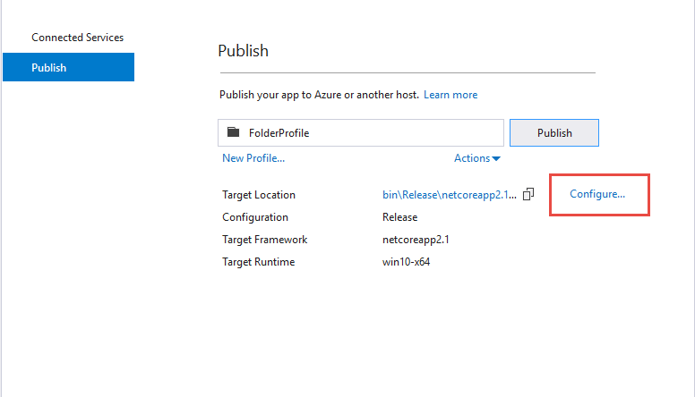
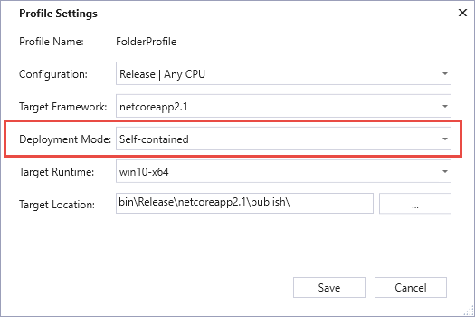

Sample A2A Service
==================

TopShelf service that can be run to demonstrate monitoring for password changes via the Application to Application (A2A) functionality in Safeguard.

This is built using the SafeguardDotNet nuget package from nuget.org, not using the source code from
this repository.

This sample demonstrates:

- thumbprint-based client certificate authentication from a Windows host (most secure method)
- uses A2A for listening for password changes
- parameters are loaded from app.config
- Serilog logging goes to a console when run interactively and to rolling files when installed as a service


To test the sample:

Configure Safeguard
===================

If you already have a CA cert and SSL client certificate you can use use those. Just replace the thumbprint below with the thumbprint of your client certificate. If not, there are test certificates in the certs folder of the project that you can use to set up the sample:

1. Log in to your Safeguard appliance as a user administrator. Create a new local user called a2a. On the authentication tab select "Certificate" specify the thumbprint: ec1c1c5862471c27925b9c7180eb4facf8398c58 (or your client cert thumbprint). On the permissions tab select "Auditor".
2. Log in to your Safeguard appliance as an appliance administrator and go to Settings -> Certificates -> Trusted Roots and add test-ca.crt (or your own CA cert) as a Trusted Root.
3. Now go to External Integration -> Application to Application. Add a new registration called test. Select the a2a user. Select the  credential retrieval checkbox. On the Credential Retrieval tab select some accounts to monitor for password changes. If there are no accounts, you need to add some accounts first.
 

Configure the Sample A2A Service
================================
1. In Visual Studio, right click the SampleA2aService and select Publish. Click the configure button:



2. Configure the profile settings as shown below. Make sure to select **Self-contained** for the deployment mode. This will produce an executable that you can run as a service.



3. Click the publish button then click the target location link to open the folder where the service was published.

4. Copy the files to the machine where you want to run the service. 

On the machine where you will run the service:

1. Install test.full.pfx (or your own client certificate) to Current User\Personal. The password for the test certificate is test123. Make sure to mark the checkbox for "Mark this key as exportable". 

2. Locate the SampleA2aService.dll.config file and modify it as follows: (be sure to specify your safeguard network address and change the thumbprint if you are using your own certificate)

```
<?xml version="1.0" encoding="utf-8"?>
<configuration>
    <appSettings>
        <add key="SafeguardAddress" value="<your network address>" />
        <add key="SafeguardClientCertificateThumbprint" value="ec1c1c5862471c27925b9c7180eb4facf8398c58" />
        <add key="SafeguardApiVersion" value="2" />
        <add key="SafeguardIgnoreSsl" value="true" />
        <add key="LoggingDirectory" value="Logs" />
    </appSettings>
</configuration>
```
4. Start the service from the command line: `SampleA2aService.exe`

Install the Service
===================

To run as a Windows service:

`SampleA2aService.exe install`

`net start Samplea2aService`

Notes
=====

This sample demonstrates a lot of integration functionality in Safeguard and demonstrates the secure
method for running an external integration application against Safeguard.  Using A2A and client
certificate authentication are the preferred methods for accessing the Safeguard API from an automated
process.  This same technique can be used in your own custom integrations and robotic process automations
(RPAs).  Using a client certificate securely enrolled via a secure certificate enrollment process where
the private key has never left the certificate store is the most secure option.
